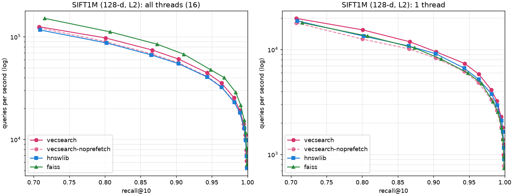
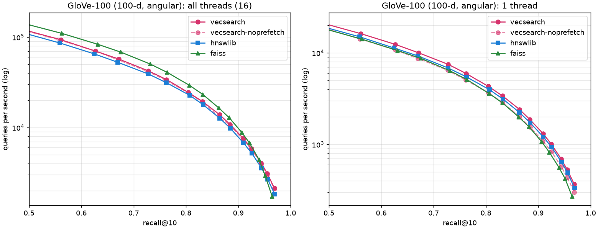

# Results

Every number in this file was produced by a script in this repo; the command is given next to
each table. Anything not yet measured is marked TBD.

## Hardware and software

| | |
|---|---|
| CPU | AMD Ryzen 9 270 w/ Radeon 780M Graphics (8 cores / 16 threads, Zen 4, AVX2 + FMA + AVX-512) |
| Host | Windows 11 laptop, 16 GB RAM |
| Environment | Docker Desktop, WSL2 VM (Linux 6.18.33.2-microsoft-standard-WSL2), 16 vCPUs, 7.9 GB RAM visible |
| OS image | Ubuntu 24.04 (`docker/dev.Dockerfile`) |
| Compiler | GCC 13.3.0, `-O3` (CMake Release) |
| Power | Windows power mode **Eco**. Every engine and every phase ran under this same setting, so comparisons are like for like; absolute QPS and latency would be higher in a performance mode. |

Caveats: this is a laptop, so clocks depend on power and temperature (the benchmark library
reports a nominal 3993 MHz). Everything runs inside a WSL2 virtual machine, which adds a little
overhead to memory-intensive work and hides hardware performance counters (see Phase 4).

## Phase 2: Distance kernel microbenchmarks

Command:

```bash
cmake --preset bench && cmake --build --preset bench --target bench_distance
./build/bench/bench/micro/bench_distance --benchmark_repetitions=3 --benchmark_min_time=0.2s \
  --benchmark_report_aggregates_only=true \
  --benchmark_out=bench/micro/results/distance.json --benchmark_out_format=json
python3 bench/micro/summarize.py bench/micro/results/distance.json
```

Raw output: `bench/micro/results/distance.json` (tables: `distance.md`), from the `bench/run_all.sh` run. Medians of 3 repetitions.

Kernels:

- `scalar`: the reference loop in `src/distance/scalar.cpp`, library build flags (`-O3`, baseline x86-64).
- `autovec_O3_native`: the identical loop compiled with `-O3 -march=native` (znver4).
- `autovec_O3_native_fastmath`: the same plus `-ffast-math`.
- `avx2`: the hand-written AVX2 + FMA kernel in `src/distance/avx2.cpp` (what the indexes use on this machine).

Two scenarios:

- **hot**: the same two vectors on every call, so both are in L1. GB/s = 2 × dim × 4 bytes per call.
- **scan**: one query against a 256 MiB database read sequentially (far larger than the cache),
  so every call streams a new vector from DRAM. GB/s = dim × 4 bytes per call.

### hot / l2: ns per call (GB/s)

| dim | scalar | autovec_O3_native | autovec_O3_native_fastmath | avx2 |
|---:|---:|---:|---:|---:|
| 32 | 13.4 (19.1) | 11.5 (22.3) | 2.8 (90.3) | 3.2 (80.5) |
| 64 | 35.7 (14.4) | 29.6 (17.4) | 4.0 (127.3) | 4.1 (125.8) |
| 128 | 73.7 (13.9) | 71.5 (14.3) | 7.0 (146.9) | 6.3 (164.2) |
| 384 | 301.4 (10.2) | 297.1 (10.3) | 18.3 (168.0) | 16.2 (189.4) |
| 768 | 648.1 (9.5) | 656.6 (9.4) | 39.9 (154.0) | 32.5 (189.1) |
| 1536 | 1333.6 (9.3) | 1340.4 (9.2) | 82.3 (150.0) | 62.5 (196.7) |

### hot / dot: ns per call (GB/s)

| dim | scalar | autovec_O3_native | autovec_O3_native_fastmath | avx2 |
|---:|---:|---:|---:|---:|
| 32 | 12.3 (20.8) | 11.3 (22.7) | 2.6 (98.6) | 2.8 (91.3) |
| 64 | 33.0 (15.5) | 29.8 (17.3) | 3.9 (131.5) | 3.9 (132.1) |
| 128 | 71.6 (14.3) | 76.0 (13.5) | 6.5 (158.6) | 5.6 (181.8) |
| 384 | 297.5 (10.3) | 305.4 (10.1) | 17.8 (172.2) | 16.1 (190.8) |
| 768 | 641.7 (9.6) | 652.2 (9.4) | 39.5 (155.9) | 31.8 (193.2) |
| 1536 | 1326.3 (9.3) | 1362.3 (9.1) | 85.1 (144.4) | 63.7 (193.0) |

### scan / l2: ns per call (GB/s)

| dim | scalar | autovec_O3_native | autovec_O3_native_fastmath | avx2 |
|---:|---:|---:|---:|---:|
| 32 | 14.3 (9.0) | 12.1 (10.6) | 3.9 (33.0) | 4.2 (30.6) |
| 64 | 36.4 (7.0) | 30.7 (8.4) | 7.7 (33.1) | 9.6 (26.6) |
| 128 | 75.3 (6.8) | 75.8 (6.8) | 17.2 (29.7) | 18.0 (28.4) |
| 384 | 308.3 (5.0) | 305.8 (5.0) | 45.1 (34.0) | 48.1 (31.9) |
| 768 | 712.1 (4.3) | 662.9 (4.6) | 86.2 (35.7) | 98.3 (31.3) |
| 1536 | 1352.0 (4.5) | 1399.7 (4.4) | 196.2 (31.3) | 229.9 (26.7) |

### scan / dot: ns per call (GB/s)

| dim | scalar | autovec_O3_native | autovec_O3_native_fastmath | avx2 |
|---:|---:|---:|---:|---:|
| 32 | 15.7 (8.2) | 11.9 (10.8) | 3.8 (33.9) | 3.9 (32.4) |
| 64 | 35.4 (7.2) | 31.8 (8.1) | 7.1 (35.8) | 7.4 (34.8) |
| 128 | 70.7 (7.2) | 75.4 (6.8) | 14.8 (34.7) | 15.3 (33.4) |
| 384 | 302.5 (5.1) | 308.6 (5.0) | 52.1 (29.5) | 51.5 (30.4) |
| 768 | 643.7 (4.8) | 663.7 (4.6) | 96.0 (32.0) | 96.8 (31.7) |
| 1536 | 1354.0 (4.6) | 1382.4 (4.5) | 175.8 (35.0) | 186.2 (33.0) |

### Discussion

- **`-O3 -march=native` alone does nothing.** The plain loop stays scalar (`vaddss` in the
  disassembly) and runs at the scalar speed. Floating-point addition is not associative, so
  without permission to reorder the sum, the compiler cannot split it across vector lanes.
- **With `-ffast-math` the compiler gets close.** It vectorizes with 512-bit AVX-512 registers
  and is 11–34% slower than the hand kernel for dim ≥ 128 when data is in L1, and equal or
  slightly faster at dim 32 and 64, where the hand kernel's main loop runs only once or twice and
  its fixed costs (zeroing four accumulators, the horizontal sum) dominate. The disassembly shows
  why it is not faster despite 2× wider registers: its main loop has a *single* accumulator
  (`vmulps` + `vaddps` into one `zmm`), so every iteration waits for the previous add. The hand
  kernel uses four independent FMA accumulators. `-ffast-math` is not an option for the library
  anyway: it changes NaN/infinity semantics for the whole translation unit.
- **The hand AVX2 kernel is ~20× faster than scalar** when data is in L1 (e.g. dim 768:
  648 → 32.5 ns for L2), reaching ~190 GB/s of L1 load bandwidth.
- **Once data comes from DRAM, every vectorized kernel hits the same wall**: ~27–36 GB/s
  single-thread streaming bandwidth, for all dims. In the scan test the hand AVX2 kernel and the
  fast-math auto-vectorized kernel are within ~15% of each other, and the auto-vectorized one is
  sometimes ahead (e.g. L2 at dim 768: 86 vs 98 ns); the arithmetic is no longer what limits
  them. The scalar kernel is still compute bound (4–9 GB/s), so SIMD helps 3–7× there, not 20×.
- **Implication for HNSW**: graph search touches vectors in an unpredictable order, so each
  distance computation is likely a cache miss (latency bound, worse than streaming). SIMD makes
  the arithmetic nearly free; the remaining cost is memory access. Phase 4 measures this.

## Phase 3: HNSW correctness

Command (after `python3 bench/ann/make_subset.py data/sift-128-euclidean.hdf5 100000 data/sift100k`):

```bash
./build/bench/bench/ann/hnsw_eval data/sift100k.base.fbin data/sift100k.query.fbin l2 16 200 0 10,20,40,60,80,120,160
```

Random 100k subset of SIFT1M (seed 0), all 10k queries, ground truth recomputed exactly with
`FlatIndex` on the subset. M = 16, ef_construction = 200, 16 build threads. Raw output:
`bench/ann/results/phase3_sift100k.txt`.

| ef_search | recall@10 |
|---:|---:|
| 10 | 0.7799 |
| 20 | 0.8944 |
| 40 | 0.9632 |
| 60 | 0.9829 |
| 80 | 0.9904 |
| 120 | 0.9957 |
| 160 | 0.9973 |

Build: 3.34 s on 16 threads. Acceptance (recall@10 ≥ 0.95 at a reasonable ef) is met at
ef = 40. Save → load → search returns identical ids and distances. The tool also prints QPS,
but those are single 10k-query runs; proper throughput measurements are in Phase 4.

Other correctness results (from the unit tests and tools, see DESIGN.md):

- Neighbor-selection heuristic vs closest-M (`Hnsw.HeuristicBeatsClosestM`, 20k points in 100
  tight clusters, dim 8, M = 6, ef = 20): recall@10 0.28 vs 0.61.
- Parallel build quality (`bench/ann/parallel_build_quality`, output in
  `bench/ann/results/parallel_build_quality.txt`): the sequential first 1,000 inserts recover
  almost all of the quality lost by a 16-thread build on the earliest nodes.
- ASan + UBSan (`ctest --preset sanitizer`) and TSan (`ctest --preset tsan`) run the full suite,
  including 4- and 8-thread builds and parallel searches, with no reports.

## Phase 4: ANN benchmarks

Command: `make bench` (= `bash bench/run_all.sh`). It builds everything, downloads the datasets,
runs `bench/ann/run.py` once per (dataset, engine) in a separate process, and writes
`bench/ann/results/<dataset>_<engine>.json`, the plots, `tables.md` and the perf profile.
Log of the run used here: `bench/ann/results/run_all.log`.

**Methodology** (identical for every engine; `bench/ann/run.py`, `bench/ann/engines.py`):

- Datasets: ann-benchmarks HDF5 files. SIFT1M: 1,000,000 × 128, L2. GloVe-100: 1,183,514 × 100,
  angular (cosine; Faiss gets normalized vectors and inner product). 10,000 test queries each,
  recall@10 against the files' ground truth.
- Engines: vecsearch (this repo), hnswlib 0.8.0 and Faiss 1.15.1 `IndexHNSWFlat` (both from
  pip). `vecsearch-noprefetch` is this engine with software prefetching turned off: the
  before/after of the profiling-driven optimization below.
- Same parameters for all: M = 16 (32 links on layer 0 in all three), ef_construction = 200,
  16 threads to build and for the "16 threads" runs.
- Throughput: one batch call with all 10,000 queries from NumPy. Best of 7 runs with 16 threads,
  best of 3 with 1 thread.
- Latency: one query per call, one thread, the first 2,000 queries, at the smallest ef where the
  engine reaches recall@10 ≥ 0.95. Includes the Python call overhead (a few µs, the same for
  all).
- Memory: growth of the process RSS during the build (vectors + graph + allocator overhead).
- One run per configuration on a laptop in Eco mode (see Hardware). Comparing the two full runs
  made during development, run-to-run noise is roughly ±5% for single-thread numbers and up to
  ±10% for 16-thread numbers (a 16-thread batch lasts only 0.1–5 s). Smaller differences are not
  meaningful.




### SIFT1M (128-d, L2), at recall@10 ≈ 0.95

| engine | build (s) | RSS growth (MiB) | QPS @0.95, 16 threads (ef) | QPS @0.95, 1 thread | QPS @0.99, 1 thread | p50 / p99 latency @0.95 (ms) |
|---|---:|---:|---:|---:|---:|---:|
| vecsearch | 64.5 | 726 | 35,437 (64) | 5,834 | 2,286 | 0.179 / 0.316 |
| vecsearch-noprefetch | 69.5 | 726 | 32,762 (64) | 4,833 | 1,817 | 0.214 / 0.391 |
| hnswlib | 75.0 | 753 | 32,252 (64) | 5,188 | 2,096 | 0.204 / 0.453 |
| faiss | 75.4 | 679 | 39,998 (64) | 4,740 | 2,538 | 0.237 / 0.393 |

"@0.95" is the first ef in the sweep with recall ≥ 0.95: ef = 64 for all four (recall 0.963,
0.963, 0.964, 0.968). "@0.99" is the first ef with recall ≥ 0.99: 192 for vecsearch and
hnswlib, 128 for Faiss, whose recall at equal ef is slightly higher.

### GloVe-100 (100-d, angular), at recall@10 ≈ 0.95

| engine | build (s) | RSS growth (MiB) | QPS @0.95, 16 threads (ef) | QPS @0.95, 1 thread | p50 / p99 latency @0.95 (ms) |
|---|---:|---:|---:|---:|---:|
| vecsearch | 88.5 | 784 | 2,784 (1024) | 415 | 2.45 / 3.77 |
| vecsearch-noprefetch | 100.7 | 785 | 2,597 (1024) | 332 | 3.10 / 5.07 |
| hnswlib | 106.9 | 761 | 2,519 (1024) | 352 | 3.05 / 7.18 |
| faiss | 102.5 | 677 | 2,593 (1024) | 308 | 3.42 / 6.99 |

GloVe is much harder than SIFT: with M = 16 every engine needs ef ≈ 1024 for 0.95 recall@10,
and none reaches 0.99 in the sweep, which stops at ef = 1536 with recall ≈ 0.97. The full sweeps
(every ef: recall, QPS with 16 threads and 1 thread) are in `bench/ann/results/tables.md`.

### Profile of the search hot path

Command: `python3 bench/ann/profile.py --ef 64 --seconds 20` (run by `make bench`; needs Linux
`perf`, and in Docker `--privileged`). `bench/ann/profile_search` searches all SIFT1M queries on
one thread in a loop; the counters of a run that only loads the index are subtracted, and the
rest is divided by the number of queries.

| prefetch | cycles/query | instructions/query | IPC | L1d misses/query | LLC misses/query | branch misses/query |
|---|---:|---:|---:|---:|---:|---:|
| off | 738,142 | 233,448 | 0.32 | 15,491 | 13,462 | 1,875 |
| on | 559,941 | 306,559 | 0.55 | 16,497 | 14,095 | 2,031 |

`profile.md` also has a QPS column from a separate 5-second run. In this run it came out as 4,780
vs 4,805, which disagrees with the cycle counts and with the sweep above. A single 5-second run
is the least reliable number here; the 20-second counter runs and the best-of-3 sweeps both show
about 20% for prefetching.

`perf record` (sampling, prefetch off, during development): ~51% of cycles in the AVX2 `l2_sq`
kernel and ~43% in the layer-0 search loop (inlined into the search lambda). `perf annotate`
showed:

- inside `l2_sq`, ~55% of its samples on the first loads of the vector (`vsubps` with a memory
  operand): the kernel is waiting for the vector to arrive from DRAM, not computing;
- inside the search loop, ~17% of its samples right after `cmp %dx,(%rax)`, the load of
  `visited.marks[id]`, a random 2-byte read from a 2 MB array: another cache miss per neighbor.

**Reading the profile.** IPC 0.3 on a core that can retire 4+ instructions per cycle means the
search is almost always stalled on memory. ~13,500 last-level cache misses per query at ef = 64
is about one DRAM miss per cache line of every vector visited (a 128-d vector is 8 lines). Each
neighbor was a chain: load its visited mark (miss), then its vector (miss), then compute, and the
next neighbor started only after that. Phase 2 had already shown that the kernel arithmetic is
nearly free; the time is DRAM latency, paid one miss at a time.

### Optimization made because of the profile: batched software prefetching

`search_layer` now processes an expanded node's neighbor list in three passes: (1) prefetch the
visited marks of all neighbors; (2) test-and-set them, collect the unvisited ones, and prefetch
every cache line of each unvisited neighbor's vector; (3) compute the distances. It also
prefetches the neighbor block of the next candidate (the new heap top) as soon as the current
one is popped. The misses still happen (LLC misses per query: 13.5k vs 14.1k) but they overlap
instead of queueing: cycles per query −24%, IPC 0.32 → 0.55.

Before/after, same build and graph, `prefetch` toggled at runtime:

| | prefetch off | prefetch on | change |
|---|---:|---:|---:|
| SIFT1M, 1 thread, ef 64 (recall 0.963): QPS | 4,833 | 5,834 | +21% |
| SIFT1M: p50 / p99 latency (ms) | 0.214 / 0.391 | 0.179 / 0.316 | −16% / −19% |
| GloVe-100, 1 thread, ef 1024 (recall 0.956): QPS | 332 | 415 | +25% |
| GloVe-100: p50 / p99 latency (ms) | 3.10 / 5.07 | 2.45 / 3.77 | −21% / −26% |
| SIFT1M, 16 threads, ef 64: QPS | 32,762 | 35,437 | +8% |

A first, simpler version (prefetch only the *next* neighbor's vector while computing the current
one, the same strategy as hnswlib's search loop) gained only ~5% (4,338 → 4,555 QPS,
`bench/ann/results/profile_v1_next_prefetch.md`): one distance computation (~20 ns) is too short
to hide a ~100 ns DRAM miss. Prefetching a whole neighbor list at once gives the memory system
10–30 independent misses to work on in parallel.

### Analysis: where vecsearch wins and loses

- **On one thread, vecsearch is the fastest on both datasets.** At recall ≈ 0.95: SIFT1M 5,834
  QPS vs hnswlib 5,188 (+12%) and Faiss 4,740 (+23%); GloVe 415 vs 352 (+18%) and 308 (+35%).
  Tail latency is lower too (SIFT p99 0.32 ms vs 0.45 / 0.39). The graphs are nearly identical
  (same algorithm and parameters; recall at equal ef matches hnswlib to about the third
  decimal), so the difference is the search loop. With prefetching off, vecsearch is slightly
  *slower* than hnswlib (4,833 vs 5,188): the whole advantage is the batched prefetch, consistent
  with the profile.
- **With 16 threads on SIFT1M, Faiss is the fastest.** vecsearch reaches 35,437 QPS, 89% of
  Faiss (39,998), and 10% more than hnswlib (32,252). On GloVe at the high ef needed there, the
  three are within ~10% (2,784 / 2,519 / 2,593). From 1 to 16 threads on SIFT, vecsearch scales
  6.1×, hnswlib 6.2×, Faiss 8.4×. All scale sub-linearly: 16 threads share 8 physical cores
  (SMT) and one memory system, and HNSW search is memory-latency bound. **Why Faiss scales better
  is not established by these measurements** (no multi-threaded profile was taken). Hypotheses
  to test next: Faiss computes neighbor distances four at a time, which may suit two SMT threads
  sharing a core better than long prefetch bursts; and vecsearch's bursts of prefetches from two
  hyperthreads may oversubscribe the core's shared miss buffers (which would also explain why
  prefetching gains +21% on 1 thread but only +8% on 16). A `perf stat` of the 16-thread run
  and a run with 8 threads (one per core) would separate these.
- **Faiss has slightly higher recall at equal ef** (SIFT, ef 64: 0.968 vs 0.963). Its
  single-thread recall-vs-QPS curve is still below vecsearch's on both datasets.
- **Build time:** vecsearch builds fastest (SIFT 64.5 s vs 75.0 / 75.4; GloVe 88.5 s vs 106.9 /
  102.5). Construction runs the same `search_layer`, so it gets the same prefetching benefit
  (the no-prefetch build takes 69.5 s / 100.7 s).
- **Memory:** Faiss uses the least (SIFT: 679 MiB vs 726 for vecsearch and 753 for hnswlib). Of
  vecsearch's 726 MiB, 488 MiB are the vectors (1M × 128 floats) and 126 MiB the layer-0 graph
  (1M × 33 uint32); the rest is labels (8 bytes per node), the label hash map, and per-node
  bookkeeping. Faiss stores no external labels; vecsearch keeps int64 labels and a hash map to
  support upserts and deletes by label.

## Phase 6: Service load test

Setup: `docker compose up --build` (the multi-stage image from `service/Dockerfile`, one Uvicorn
worker), then from the dev container on the same Docker network:

```bash
python3 service/loadtest/run_loadtest.py --url http://vecsearch:8000 --users 1,4,16,64 --duration 30s
```

It loads the SIFT 100k subset over HTTP (20 batches of 5,000 upserts, with a tag per vector),
then runs Locust (`service/loadtest/locustfile.py`, `FastHttpUser`, no think time, so N users =
N requests in flight) for 30 s per level. Each request is a k = 10, ef = 64 search with a random
SIFT query vector as JSON. Raw output: `service/loadtest/results.md`.

Loading 100,000 vectors over HTTP took 12.7 s (~7,900 vectors/s, including JSON parsing and
Pydantic validation of 12.8M floats).

| concurrent users | req/s | failures | client p50 (ms) | client p99 (ms) | handler p50 / p99 (ms) | engine p50 / p99 (ms) |
|---:|---:|---:|---:|---:|---:|---:|
| 1 | 663 | 0 | 1 | 2 | 0.23 / 0.49 | 0.16 / 0.37 |
| 4 | 890 | 0 | 4 | 7 | 0.53 / 1.72 | 0.45 / 1.62 |
| 16 | 994 | 0 | 15 | 29 | 1.11 / 3.26 | 1.02 / 3.14 |
| 64 | 910 | 0 | 68 | 110 | 1.02 / 4.39 | 0.92 / 4.27 |

Columns: *client* = Locust's end-to-end latency (Locust reports whole milliseconds, so these are
coarse); *handler* = time inside the FastAPI handler (`X-Handler-Time-Ms`); *engine* = the C++
search call (`X-Engine-Time-Ms`).

**Where the time goes.** With one user, a request takes ~1 ms end to end, of which the engine
is ~0.16 ms (16%) and the whole handler ~0.23 ms. The other ~0.75 ms is outside the handler:
HTTP parsing, JSON decoding of 128 floats, Pydantic validation, response serialization, the
event-loop/threadpool hand-off, and the Docker network hop. Throughput saturates at about
**1,000 req/s** from 16 users on, while the engine alone does ~5,800 QPS per thread on the much
larger SIFT1M (Phase 4). Past saturation, extra users only queue (p50 68 ms at 64 users).

**Why it saturates:** everything except the C++ search holds Python's GIL, and there is a single
Uvicorn worker process, so the Python request path runs on effectively one core. The engine
times also grow under load (0.16 → ~1 ms) even though the C++ search itself does not slow down
that much: the measured interval ends when the pybind call returns, which requires re-acquiring
the GIL, so under contention it includes waiting for the GIL. Locust runs on the same machine
and takes CPU too.

What would raise throughput (not done; outside this phase's scope): several worker processes
(each would need its own copy of the index, or the index in shared memory), batching
concurrent queries into one engine call, a binary request format instead of JSON float arrays,
or a non-Python front end.

### Filtered search: recall and cost vs. filter selectivity

Command: `python3 bench/ann/filter_recall.py --ef 64` (and `--ef 256`). SIFT 100k subset,
1,000 queries, 1 thread; a random fraction of ids is allowed; ground truth = exact top-10 among
the allowed vectors. Raw output: `bench/ann/results/filter_recall.md`.

| selectivity | allowed vectors | recall@10 (ef 64) | filtered HNSW QPS (ef 64) | brute force over allowed QPS |
|---:|---:|---:|---:|---:|
| 100% (no filter) | 100,000 | 0.9836 | 8,481 | 470 |
| 50% | 50,000 | 0.9934 | 5,177 | 1,123 |
| 10% | 10,000 | 0.9995 | 1,519 | 8,051 |
| 1% | 1,000 | 1.0000 | 254 | 57,521 |
| 0.1% | 100 | 1.0000 | 43 | 421,321 |

Recall does not drop with these (random, uncorrelated) filters; it rises, because the search
keeps expanding until it has ef = 64 *allowed* results and so explores far more of the graph.
The cost is latency: 33× fewer QPS at 1% selectivity. Brute force over the allowed set wins
somewhere between 50% and 10% selectivity, so a real system should switch strategies per query
(see DESIGN.md, Filtering). Correlated filters were not measured.

## Resume bullets (numbers from this file)

- Implemented an HNSW approximate nearest neighbor index from scratch in C++20 with
  hand-written AVX2/NEON distance kernels and multithreaded search, reaching 5,834 QPS on one
  thread at 0.963 recall@10 on SIFT1M (112% of hnswlib's and 123% of Faiss's single-thread
  throughput at equal parameters; 89% of Faiss with 16 threads).
- Profiled the search hot path with `perf` (IPC 0.32, ~13.5k LLC misses per query), identified
  serialized DRAM misses on vector and visited-list loads, and added batched software
  prefetching, improving single-thread throughput by 21% and cutting p99 latency by 19%.
- Exposed the engine through zero-copy pybind11 bindings (GIL released) and a Dockerized
  FastAPI service with metadata-filtered search, sustaining ~990 req/s with p99 29 ms at 16
  concurrent clients; measured that ~84% of single-request latency is HTTP/Python overhead, not
  the engine.

(Measured on a laptop in Eco power mode; see Hardware.)
