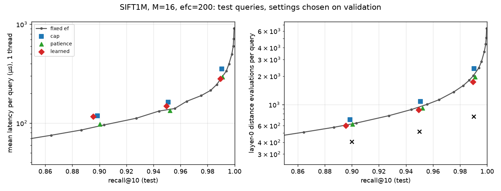

# Learned early termination for HNSW search: SIFT1M results

**Short answer: no latency win on SIFT1M.** A small learned policy (a gradient-boosted tree
model that predicts each query's distance-evaluation budget) reduces layer-0 distance
evaluations by roughly 7–14% compared with the fixed-ef curve at matched test recall. Its
single-thread latency is no better than fixed ef or a tuned patience heuristic. Two things
cancel the saving: the larger beam the policy needs makes every evaluation more expensive, and
prediction adds overhead. The 0.15 ms search on SIFT leaves little room for this. This matches the
expectation stated before the study, that a negative result on SIFT was plausible.

Protocol and amendments: [PROTOCOL.md](PROTOCOL.md) (committed before the test runs). Raw outputs:
`bench/ann/results/adaptive_search/sift1m_v1/`. Prior work: Li, Zhang, Andersen, He, "Improving
Approximate Nearest Neighbor Search through Learned Adaptive Early Termination", SIGMOD 2020.
This study reimplements their HNSW approach (run with a large beam, stop at a predicted budget)
inside vecsearch and evaluates it. No new method is claimed.

## Setup

| | |
|---|---|
| Data | SIFT1M, L2. Base = ann-benchmarks `train`, verified byte-identical to TEXMEX `sift_base` |
| Index | One snapshot: M 16, ef_construction 200, seed 100, built on 1 thread (420 s, deterministic, sha256 `1ff6d63a…`) |
| Training queries | 89,788 TEXMEX learn vectors. Of the 100k, **10,017 were exact copies of test queries** and 195 were duplicates; all were dropped |
| Validation / test | 5,000 / 5,000 of the 10k ann-benchmarks queries (seed 0 permutation) |
| Ground truth | Exact top-10 from FlatIndex. Cost: learn 873 s, val 49 s, test 49 s (16 threads) |
| Timing | One query per C++ call, 1 thread pinned to CPU 3, Release `-O3` with AVX2 kernels, 1 warmup + 5 timed passes with config order rotated. Mean is the median of the per-pass means (min–max across passes in brackets) |
| Machine | Ryzen 9 270 (8C/16T), WSL2 / Docker, GCC 13.3.0, Ultimate Performance power plan, no other heavy jobs during timing |
| Code | `experiment/adaptive-search` @ 1aa033b, plus an uncommitted 2-line fix to how the driver prints multipliers (committed afterwards in the next commit) |

Distance evaluations are counted on layer 0 only; the greedy descent through the upper layers
is identical for every method.

## Methods (all settings chosen on validation, then run once on test)

- **fixed**: plain `search()` at fixed ef. 22 values, 10–512. The matched point is the smallest ef that reaches the target on validation.
- **cap**: `search_adaptive` with a large beam (`ef_max`) and the same distance budget for every query.
- **patience**: stop after N consecutive expansions with no change to the top-10 (ef × N grid).
- **learned**: at a checkpoint (100/200/400 evaluations), compute 9 search-state features
  (distance ratios between the entry point, d_1, d_k and the closest candidate; how stale the
  top-k is; number of top-k changes), optionally plus the raw query vector. A model predicts
  log(evaluations needed), and the budget is `max(checkpoint, multiplier × prediction)`.
  Models: ridge and HistGradientBoosting (200 trees, ≤15 leaves), trained on learn. On
  validation, the tree model with the query vector won every time (R² of log-budget 0.65–0.66).
- **oracle**: per-query stopping points chosen with ground truth. A bound, not deployable.

The training label for each query is the number of evaluations after which its top-10 already
contains every true neighbor the full `ef_max` run finds. A budgeted run is an exact prefix of
the unbudgeted one (unit test `Adaptive.BudgetIsPrefixOfFullRun`), so one trace per query gives
recall at every budget. Simulated validation recall and evaluation counts matched the real
validation runs exactly.

## Results (test queries)

Settings chosen on validation for each target; recall below is the test result.

| target | method | config | test R@10 | mean µs (pass range) | p50 | p95 | p99 | QPS 1-thr | evals | R@10<0.8 |
|---|---|---|---:|---:|---:|---:|---:|---:|---:|---:|
| 0.90 | fixed | ef 32 | 0.9034 | 95.7 (90.1–115.0) | 93.1 | 137.6 | 169.6 | 10,452 | 638 | 0.128 |
| 0.90 | cap | ef_max 128 | 0.8987 | 118.8 (116.6–123.0) | 114.9 | 150.1 | 175.8 | 8,418 | 693 | 0.146 |
| 0.90 | patience | ef 64, N 12 | 0.9003 | 97.6 (97.3–106.6) | 93.5 | 157.2 | 192.6 | 10,241 | 621 | 0.125 |
| 0.90 | learned | GBDT+q, ef_max 128 | **0.8955 (miss)** | 116.3 (112.5–120.3) | 107.9 | 183.5 | 215.1 | 8,600 | 598 | 0.128 |
| 0.95 | fixed | ef 56 | 0.9557 | 140.3 (134.4–172.4) | 139.8 | 190.1 | 224.6 | 7,127 | 1,006 | 0.039 |
| 0.95 | cap | ef_max 128 | 0.9508 | 162.8 (160.8–172.4) | 158.5 | 199.2 | 230.6 | 6,141 | 1,077 | 0.050 |
| 0.95 | patience | ef 64, N 25 | 0.9522 | 133.4 (131.6–138.5) | 131.8 | 197.7 | 231.2 | 7,494 | 914 | 0.039 |
| 0.95 | learned | GBDT+q, ef_max 128 | 0.9495 | 149.0 (146.2–193.6) | 140.9 | 249.3 | 290.9 | 6,713 | 877 | 0.032 |
| 0.99 | fixed | ef 160 | 0.9938 | 335.6 (321.9–345.1) | 341.0 | 446.0 | 506.7 | 2,980 | 2,443 | 0.001 |
| 0.99 | cap | ef_max 256 | 0.9904 | 353.1 (345.0–377.7) | 349.5 | 413.3 | 476.0 | 2,832 | 2,394 | 0.004 |
| 0.99 | patience | ef 256, N 80 | 0.9910 | 293.6 (286.5–347.4) | 281.2 | 471.4 | 568.3 | 3,406 | 1,959 | 0.002 |
| 0.99 | learned | GBDT+q, ef_max 256 | 0.9896 | 280.6 (271.2–285.3) | 258.3 | 540.9 | 651.1 | 3,564 | 1,738 | 0.002 |

The fixed-ef grid is coarse at the matched points: ef 160 overshoots 0.99 by 0.0038. The nearest
grid point to the learned policy's recall is the fairer comparison: **ef 128 reaches 0.9899 at
282.5 µs and 2,024 evaluations**, against learned 0.9896 at 280.6 µs and 1,738 evaluations. Near
0.95, ef 48 gives 0.9440 at 132.2 µs and 886 evaluations.



Right panel: the black × marks are the oracle (ground-truth stopping points): 404 / 519 / 749
evaluations at recall 0.90 / 0.95 / 0.99.

### Against the predeclared success rule

The rule: the learned policy wins at a target if its test latency beats both fixed ef and
patience by more than the pass-to-pass spread, with test recall no more than 0.002 below theirs.

- 0.90: **loss**. Learned is slower than both and misses the target (0.8955).
- 0.95: **loss**. 149.0 µs vs 140.3 (fixed) and 133.4 (patience).
- 0.99: **no win**. Learned's pass range (271–285 µs) does not overlap patience's (287–347),
  but its recall is 0.0014 lower. Against fixed ef at matched recall (ef 128: 282.5 µs), it
  is a tie. Fixed ef 160 is slower but has 0.0042 more recall, which is outside the matching rule.

All three learned settings ended slightly below their validation target on test (−0.0045,
−0.0005, −0.0004). The multipliers were fitted exactly to validation recall, so they carry no
margin. These are reported as misses.

## Why the saved evaluations don't become saved time

1. **A bigger beam costs more per evaluation.** The cap and learned policies need a beam
   (ef_max 128/256) large enough for slow queries. With a larger beam, more candidates enter the
   heaps, and each evaluation costs more: ~151 ns for cap@0.95 vs ~139 ns for fixed ef 56. At the
   same mean evaluation count, a large-beam run is slower than a small-ef run. The fixed
   distance cap is worse than fixed ef at every target, in both evaluations and latency.
2. **Prediction overhead.** The chosen model (200 trees over 9 features plus the 128-d query)
   costs 3.85 µs per prediction (C++ microbenchmark, `summary.json`). That is 1.4–3% of a query,
   on top of the per-evaluation top-k bookkeeping and the checkpoint branch.
3. **Prediction quality limits the gain.** R² ≈ 0.66 for log-budget. The oracle needs 40–57% fewer
   evaluations than the learned policy, so the headroom exists in principle, but these features
   don't predict it well.
4. **Tail latency gets worse.** The policy spends extra work on hard queries: p95/p99 at 0.95 are
   249/291 µs vs 190/225 for fixed ef. In return, fewer queries end with recall@10 below 0.8
   (3.2% vs 3.9%).

Patience is the hardest simple baseline. At 0.95 it is the fastest method (133 µs), and on SIFT
it gets most of the learned policy's evaluation savings with no model.

## Stress condition (predefined): rebuilt graph, no retraining

The same policies and multipliers were run on a second snapshot (graph seed 101, sha256
`a71a09e1…`). Results come from traces (exact for recall and evaluations; not timed). The policy
transfers:

| | test recall (seed 100 → 101) | evals |
|---|---|---|
| learned@0.90 | 0.8955 → 0.8956 | 598 → 598 |
| learned@0.95 | 0.9495 → 0.9490 | 877 → 877 |
| learned@0.99 | 0.9896 → 0.9898 | 1,738 → 1,738 |

A changed query distribution or index parameters (M, ef_construction) would need recalibrating
the multiplier on new validation data at least, and probably retraining.

## Checks run

- `ctest` (release): 68/68, including 12 new tests in `tests/cpp/test_adaptive.cpp`:
  - `search_adaptive` with no termination gives byte-identical results to `search()` for all three metrics, with and without deletions
  - budget-prefix property
  - patience
  - feature edge cases and zero-distance fallback
  - model ignored on indexes with deletions
  - parallel == serial results
  - malformed model files rejected
- ASan + UBSan preset: 68/68. TSan preset: 68/68 (Docker, ASLR off).
- `search()` code path unchanged: the new loop is a separate function. The regression check is
  the existing test suite. As a sanity check, fixed ef 64 on this snapshot gives 0.9645 on the
  5k test queries, against the legacy 0.9635 on all 10k with a different graph.
- **Not run:** pytest and the service tests (Python bindings untouched; `search_adaptive` is C++
  only). Legacy benchmark files were not regenerated and are not compared with these timings.

## Limitations

- SIFT1M only, single thread, one graph snapshot for timing, 5 timed passes. GloVe (where
  queries vary more and per-query cost is ~10× higher) and multithreaded throughput were not run.
  The addendum expects GloVe to benefit more, but that is untested here.
- Validated only for unfiltered search on a static index. With deletions the model is ignored and
  plain ef search runs. Filters are not supported by `search_adaptive`.
- WSL2 inside Docker on a laptop: timings are comparable within this run only.
- Training cost: 873 s of brute-force ground truth plus ~5 s per training trace and a few minutes
  of model fitting. This is not counted in per-query latency.
- One model family, one feature set, no hyperparameter tuning of the GBDT. Larger feature sets or
  checking the budget more than once might close more of the oracle gap.

## Reproduce

```bash
docker build -t vecsearch-dev -f docker/dev.Dockerfile docker
tools/dev.sh "bench/ann/adaptive/prepare_all.sh bench/ann/results/adaptive_search/sift1m_v1"   # ~25 min
for s in traces select test report stress; do
  tools/dev.sh "python3 bench/ann/adaptive/study.py $s bench/ann/results/adaptive_search/sift1m_v1"
done
```

Large intermediates (fbin splits, ground truth, traces, raw per-run ids, latencies and stats) are
in the `vecsearch-data` Docker volume under `adaptive/`. The repo keeps the manifests, models,
`summary.json` (every row, the selection and the environment) and per-query test outputs
(`per_query_test.npz`).
