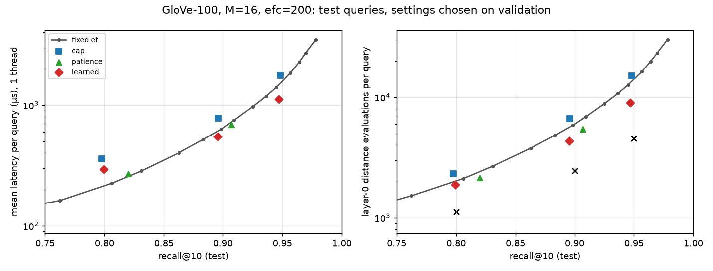

# Learned early termination for HNSW search: SIFT1M and GloVe-100 results

**Short answer: it depends on the dataset.** The policy is a small gradient-boosted tree model
that predicts each query's distance-evaluation budget.

- **SIFT1M: no latency win.** At matched test recall the policy cuts layer-0 distance evaluations
  by 7–14% compared with fixed ef, but single-thread latency is no better than fixed ef or a
  tuned patience heuristic. The larger beam it needs makes each evaluation more expensive, and
  prediction adds overhead. A SIFT search takes only ~0.15 ms, so there is little to save. This
  negative result was anticipated in the protocol.
- **GloVe-100: no win under the predeclared rule.** At the 0.95 target the policy reaches
  0.9468 test recall, missing the target by 0.0032. The validation-selected baseline is fixed
  ef 1024, at 0.9566. The gap is 0.0098, well outside the 0.002 matching allowance, so the
  predeclared matched-quality criterion is not met at any target.
- **GloVe-100, descriptive comparison:** on the measured test curve, the policy has **20.8%
  lower mean latency than fixed ef 768**, the nearest measured fixed-ef point: 1,113.9 vs
  1,406.2 µs, single thread, at recall 0.9468 vs 0.9450. Its p95/p99 latency is worse. At
  recall 0.80 it is slower than fixed ef.

[Results on GloVe-100](#glove-100) and [multithreaded throughput](#multithreaded-throughput-16-threads)
are further down. Protocol and amendments: [PROTOCOL.md](PROTOCOL.md), committed before each
test run. Raw outputs: `bench/ann/results/adaptive_search/{sift1m_v1,glove_v1}/`. Prior work: Li, Zhang, Andersen, He, "Improving
Approximate Nearest Neighbor Search through Learned Adaptive Early Termination", SIGMOD 2020.
This study reimplements their HNSW approach (run with a large beam, stop at a predicted budget)
inside vecsearch and evaluates it. No new method is claimed.

## Setup

| | |
|---|---|
| Data | SIFT1M, L2. Base = ann-benchmarks `train`, verified byte-identical to TEXMEX `sift_base` |
| Index | One snapshot: M 16, ef_construction 200, seed 100, built on 1 thread (420 s, deterministic, sha256 `1ff6d63a…`) |
| Training queries | 89,788 TEXMEX learn vectors. Of the 100k, **10,017 were exact copies of test queries** and 195 were duplicates; all were dropped |
| Validation / test | 5,000 / 5,000 of the 10k ann-benchmarks queries (seed 0 permutation) |
| Ground truth | Exact top-10 from FlatIndex. Cost: learn 873 s, val 49 s, test 49 s (16 threads) |
| Timing | One query per C++ call, 1 thread pinned to CPU 3, Release `-O3` with AVX2 kernels, 1 warmup + 5 timed passes with config order rotated. Mean is the median of the per-pass means (min–max across passes in brackets) |
| Machine | Ryzen 9 270 (8C/16T), WSL2 / Docker, GCC 13.3.0, Ultimate Performance power plan, no other heavy jobs during timing |
| Code | `experiment/adaptive-search` @ 1aa033b, plus an uncommitted 2-line fix to how the driver prints multipliers (committed afterwards in the next commit) |

Distance evaluations are counted on layer 0 only; the greedy descent through the upper layers
is identical for every method.

## Methods (all settings chosen on validation, then run once on test)

- **fixed**: plain `search()` at fixed ef. 22 values, 10–512. The matched point is the smallest ef that reaches the target on validation.
- **cap**: `search_adaptive` with a large beam (`ef_max`) and the same distance budget for every query.
- **patience**: stop after N consecutive expansions with no change to the top-10 (ef × N grid).
- **learned**: at a checkpoint (100/200/400 evaluations), compute 9 search-state features
  (distance ratios between the entry point, d_1, d_k and the closest candidate; how stale the
  top-k is; number of top-k changes), optionally plus the raw query vector. A model predicts
  log(evaluations needed), and the budget is `max(checkpoint, multiplier × prediction)`.
  Models: ridge and HistGradientBoosting (200 trees, ≤15 leaves), trained on learn. On
  validation, the tree model with the query vector won every time (R² of log-budget 0.65–0.66).
- **oracle**: per-query stopping points chosen with ground truth. A bound, not deployable.

The training label for each query is the number of evaluations after which its top-10 already
contains every true neighbor the full `ef_max` run finds. A budgeted run is an exact prefix of
the unbudgeted one (unit test `Adaptive.BudgetIsPrefixOfFullRun`), so one trace per query gives
recall at every budget. Simulated validation recall and evaluation counts matched the real
validation runs exactly.

## SIFT1M results (test queries)

Settings chosen on validation for each target; recall below is the test result.

| target | method | config | test R@10 | mean µs (pass range) | p50 | p95 | p99 | QPS 1-thr | evals | R@10<0.8 |
|---|---|---|---:|---:|---:|---:|---:|---:|---:|---:|
| 0.90 | fixed | ef 32 | 0.9034 | 95.7 (90.1–115.0) | 93.1 | 137.6 | 169.6 | 10,452 | 638 | 0.128 |
| 0.90 | cap | ef_max 128 | 0.8987 | 118.8 (116.6–123.0) | 114.9 | 150.1 | 175.8 | 8,418 | 693 | 0.146 |
| 0.90 | patience | ef 64, N 12 | 0.9003 | 97.6 (97.3–106.6) | 93.5 | 157.2 | 192.6 | 10,241 | 621 | 0.125 |
| 0.90 | learned | GBDT+q, ef_max 128 | **0.8955 (miss)** | 116.3 (112.5–120.3) | 107.9 | 183.5 | 215.1 | 8,600 | 598 | 0.128 |
| 0.95 | fixed | ef 56 | 0.9557 | 140.3 (134.4–172.4) | 139.8 | 190.1 | 224.6 | 7,127 | 1,006 | 0.039 |
| 0.95 | cap | ef_max 128 | 0.9508 | 162.8 (160.8–172.4) | 158.5 | 199.2 | 230.6 | 6,141 | 1,077 | 0.050 |
| 0.95 | patience | ef 64, N 25 | 0.9522 | 133.4 (131.6–138.5) | 131.8 | 197.7 | 231.2 | 7,494 | 914 | 0.039 |
| 0.95 | learned | GBDT+q, ef_max 128 | 0.9495 | 149.0 (146.2–193.6) | 140.9 | 249.3 | 290.9 | 6,713 | 877 | 0.032 |
| 0.99 | fixed | ef 160 | 0.9938 | 335.6 (321.9–345.1) | 341.0 | 446.0 | 506.7 | 2,980 | 2,443 | 0.001 |
| 0.99 | cap | ef_max 256 | 0.9904 | 353.1 (345.0–377.7) | 349.5 | 413.3 | 476.0 | 2,832 | 2,394 | 0.004 |
| 0.99 | patience | ef 256, N 80 | 0.9910 | 293.6 (286.5–347.4) | 281.2 | 471.4 | 568.3 | 3,406 | 1,959 | 0.002 |
| 0.99 | learned | GBDT+q, ef_max 256 | 0.9896 | 280.6 (271.2–285.3) | 258.3 | 540.9 | 651.1 | 3,564 | 1,738 | 0.002 |

The fixed-ef grid is coarse at the matched points: ef 160 overshoots 0.99 by 0.0038. The nearest
grid point to the learned policy's recall is the fairer comparison: **ef 128 reaches 0.9899 at
282.5 µs and 2,024 evaluations**, against learned 0.9896 at 280.6 µs and 1,738 evaluations. Near
0.95, ef 48 gives 0.9440 at 132.2 µs and 886 evaluations.


Right panel: the black × marks are the oracle (ground-truth stopping points): 404 / 519 / 749
evaluations at recall 0.90 / 0.95 / 0.99.

### Against the predeclared success rule

The rule: the learned policy wins at a target if its test latency beats both fixed ef and
patience by more than the pass-to-pass spread, with test recall no more than 0.002 below theirs.

- 0.90: **loss**. Learned is slower than both and misses the target (0.8955).
- 0.95: **loss**. 149.0 µs vs 140.3 (fixed) and 133.4 (patience).
- 0.99: **no win**. Learned's pass range (271–285 µs) does not overlap patience's (287–347),
  but its recall is 0.0014 lower. Against fixed ef at matched recall (ef 128: 282.5 µs), it
  is a tie. Fixed ef 160 is slower but has 0.0042 more recall, which is outside the matching rule.

All three learned settings ended slightly below their validation target on test (−0.0045,
−0.0005, −0.0004). The multipliers were fitted exactly to validation recall, so they carry no
margin. These are reported as misses.

## Why the saved evaluations don't become saved time

1. **A bigger beam costs more per evaluation.** The cap and learned policies need a beam
   (ef_max 128/256) large enough for slow queries. With a larger beam, more candidates enter the
   heaps, and each evaluation costs more: ~151 ns for cap@0.95 vs ~139 ns for fixed ef 56. At the
   same mean evaluation count, a large-beam run is slower than a small-ef run. The fixed
   distance cap is worse than fixed ef at every target, in both evaluations and latency.
2. **Prediction overhead.** The chosen model (200 trees over 9 features plus the 128-d query)
   costs 3.85 µs per prediction (C++ microbenchmark, `summary.json`). That is 1.4–3% of a query,
   on top of the per-evaluation top-k bookkeeping and the checkpoint branch.
3. **Prediction quality limits the gain.** R² ≈ 0.66 for log-budget. The oracle needs 40–57% fewer
   evaluations than the learned policy, so the headroom exists in principle, but these features
   don't predict it well.
4. **Tail latency gets worse.** The policy spends extra work on hard queries: p95/p99 at 0.95 are
   249/291 µs vs 190/225 for fixed ef. In return, fewer queries end with recall@10 below 0.8
   (3.2% vs 3.9%).

Patience is the hardest simple baseline. At 0.95 it is the fastest method (133 µs), and on SIFT
it gets most of the learned policy's evaluation savings with no model.

## Stress condition (SIFT, predefined): rebuilt graph, no retraining

The same policies and multipliers were run on a second snapshot (graph seed 101, sha256
`a71a09e1…`). Results come from traces (exact for recall and evaluations; not timed). The policy
transfers:

| | test recall (seed 100 → 101) | evals |
|---|---|---|
| learned@0.90 | 0.8955 → 0.8956 | 598 → 598 |
| learned@0.95 | 0.9495 → 0.9490 | 877 → 877 |
| learned@0.99 | 0.9896 → 0.9898 | 1,738 → 1,738 |

A changed query distribution or index parameters (M, ef_construction) would need recalibrating
the multiplier on new validation data at least, and probably retraining.

## GloVe-100

Setup changes (amendment A3):
- **Training queries:** GloVe has no learn set, so 100,000 random rows of `train` (seed 0) are
  the training queries and are removed from the index. The base is the remaining 1,083,514 rows,
  so no training query can find itself. None of the sampled rows duplicate a query, a base row or
  each other, and no vector has zero norm.
- **Metric:** cosine (vecsearch normalizes vectors), which ranks exactly like the angular ground
  truth. Ground truth is recomputed against the reduced base; it cost 934 s for learn and 47 s
  each for val and test.
- **Index:** built on 1 thread in 458 s (sha256 `e5a7ca8a…`).
- **Grids and timing:** ef_max {512, 1024, 2048}, checkpoints {250, 500, 1000}, targets
  {0.80, 0.90, 0.95}. 3 timed passes instead of 5, because GloVe queries cost ~10× more.
- **Not comparable with the legacy GloVe JSONs**, which indexed the full train set.

A bug was caught here before any test run. The C++ model sees the **normalized** query vector
(cosine search normalizes the query first), but training first used the raw query. On validation,
simulated recall and real recall disagreed (0.800 vs 0.788 at the 0.80 target), which exposed it.
After the fix (commit "normalize query-vector model inputs for cosine") they match exactly. SIFT
uses L2 and was not affected.

| target (val) | method | config | test R@10 | mean µs (pass range) | p50 | p95 | p99 | QPS 1-thr | evals |
|---|---|---|---:|---:|---:|---:|---:|---:|---:|
| 0.80 | fixed | ef 96 | 0.8062 | 225.1 (224.6–239.2) | 221.8 | 310.9 | 366.3 | 4,443 | 2,117 |
| 0.80 | cap | ef_max 512 | 0.7976 | 359.7 (334.5–359.8) | 347.6 | 434.8 | 516.9 | 2,780 | 2,317 |
| 0.80 | patience | ef 256, N 40 | 0.8201 | 270.7 (268.8–276.1) | 243.1 | 510.9 | 642.4 | 3,694 | 2,153 |
| 0.80 | learned | GBDT+q, ef_max 512 | 0.7994 | 293.4 (293.2–300.3) | 232.0 | 523.0 | 580.8 | 3,409 | 1,889 |
| 0.90 | fixed | ef 320 | 0.8986 | 631.6 (630.4–637.2) | 638.9 | 819.2 | 924.1 | 1,583 | 5,859 |
| 0.90 | cap | ef_max 512 | 0.8960 | 780.3 (778.4–840.0) | 779.6 | 894.9 | 1,046.8 | 1,282 | 6,617 |
| 0.90 | patience | ef 512, N 160 | 0.9070 | 688.3 (645.3–701.9) | 592.3 | 1,305.0 | 1,546.0 | 1,453 | 5,451 |
| 0.90 | learned | GBDT+q, ef_max 512 | 0.8955 | **548.5** (540.0–570.1) | 440.0 | 1,144.0 | 1,281.9 | 1,823 | 4,322 |
| 0.95 | fixed | ef 1024 | 0.9566 | 1,840.8 (1,835.0–1,949.2) | 1,866.6 | 2,369.1 | 2,610.5 | 543 | 16,290 |
| 0.95 | cap | ef_max 1024 | 0.9483 | 1,768.0 (1,751.3–1,836.2) | 1,847.5 | 2,106.3 | 2,320.8 | 566 | 14,961 |
| 0.95 | learned | GBDT+q, ef_max 1024 | 0.9468 | **1,113.9** (1,107.9–1,147.3) | 842.5 | 2,447.9 | 2,666.7 | 898 | 9,022 |

Patience cannot reach 0.95 on validation anywhere in its grid (N up to 320), so it has no 0.95
row. Nearby fixed-ef points from the same timed run:

| fixed ef | test R@10 | mean µs (pass range) | p95 | p99 | evals |
|---:|---:|---:|---:|---:|---:|
| 256 | 0.8836 | 519.4 (513.1–523.5) | 669 | 748 | 4,828 |
| 768 | 0.9450 | 1,406.2 (1,401.2–1,406.9) | 1,806 | 1,957 | 12,634 |



Against the predeclared rule (beat both fixed ef and patience by more than the pass spread,
with recall within 0.002 of theirs). The comparators are the settings validation selected:

- **0.95: criterion not met.** The validation-selected fixed baseline is ef 1024, with test
  recall 0.95658. The learned policy reaches 0.94678, a gap of 0.00980, far outside the 0.002
  allowance. No patience setting reached 0.95 on validation, so there is no patience comparator.
  The policy also missed its own 0.95 target by 0.0032. The policy was not retuned on test.
  - *Descriptive comparison on the measured test curve*, not part of the rule: fixed ef 768 (a
    sweep point, not the validation-selected comparator) reaches 0.94500 at 1,406.2 µs mean. The
    learned policy's 1,113.9 µs is **20.8% lower**, at slightly higher recall (0.94678), and the
    pass ranges do not overlap. Its tails are worse: p95/p99 2,448/2,667 µs vs 1,806/1,957.
- **0.90: criterion not met.** The recall gap to fixed ef 320 is 0.0031 (> 0.002), and
  patience lands 0.0115 higher. Interpolating the fixed-ef curve between ef 256 and 320 gives
  ≈608 µs at 0.8955, about 10% slower than the learned policy's 548.5 µs. That is a reading of the
  curve, not a matched measurement.
- **0.80: loss.** Fixed ef 96 is faster (225 vs 293 µs) at higher recall.

Why GloVe responds and SIFT does not: GloVe queries vary far more in difficulty, and an evaluation is a
smaller share of the cost. Predicted budgets explain more of the variance (validation R² of
log-budget 0.83 vs 0.66). At 0.95 the policy uses 45% fewer evaluations than fixed ef 1024 and
29% fewer than ef 768, which outweighs the bigger-beam cost and the 4.8 µs prediction. The
oracle (4,543 evaluations at 0.95) shows there is still roughly 2× headroom. Tails remain the
cost: p95/p99 at 0.95 are 2,448/2,667 µs vs 1,806/1,957 for ef 768, because hard queries get a
large budget.

## Multithreaded throughput (16 threads)

Each matched config runs all 5k test queries in one batch call on 16 threads (all logical CPUs);
best of 5 runs. Results are checked identical to the single-thread run. Recall is the
single-thread test recall from the tables above.

| dataset | target | fixed ef (R@10) | patience | learned | cap |
|---|---|---|---|---|---|
| SIFT | 0.90 | 60,190 (0.9034) | 60,290 (0.9003) | 60,556 (0.8955) | 53,789 |
| SIFT | 0.95 | 39,414 (0.9557) | 42,969 (0.9522) | 43,024 (0.9495) | 36,222 |
| SIFT | 0.99 | 16,455 (0.9938) | 20,199 (0.9910) | 22,552 (0.9896) | 16,521 |
| GloVe | 0.80 | 24,288 (0.8062) | 23,702 (0.8201) | 24,834 (0.7994) | 20,779 |
| GloVe | 0.90 | 7,915 (0.8986) | 9,389 (0.9070) | 11,649 (0.8955) | 7,607 |
| GloVe | 0.95 | 3,072 (0.9566) | — | 5,617 (0.9468) | 3,356 |

With 16 threads competing for memory bandwidth, fewer distance evaluations matter more than on
one thread, so the learned policy does relatively better. The recall caveats above still apply:
in several rows the fixed-ef point has higher recall. On SIFT, learned and patience are within a
few percent of each other everywhere. The fixed-ef points closest to the learned recall (SIFT
ef 128, GloVe ef 768) were not run multithreaded, so no matched-recall multithread speedup is
claimed.

## Checks run

- `ctest` (release): 69/69, also with `ctest -j16` (test temp files are now unique per test),
  including 13 new tests in `tests/cpp/test_adaptive.cpp`:
  - `search_adaptive` with no termination gives byte-identical results to `search()` for all three metrics, with and without deletions
  - budget-prefix property
  - patience
  - feature edge cases and zero-distance fallback
  - model ignored on indexes with deletions; explicit max_evals / patience still apply (fallback contract)
  - parallel == serial results
  - malformed model files rejected
- ASan + UBSan and TSan presets: 68/68 locally before the fallback-contract test was added;
  CI runs both on every push. Service tests: 34/34.
- `search()` code path unchanged: the new loop is a separate function. The regression check is
  the existing test suite. As a sanity check, fixed ef 64 on this snapshot gives 0.9645 on the
  5k test queries, against the legacy 0.9635 on all 10k with a different graph.
- Python: wheel built and `pytest tests/python` 73/73 passed, README example ran (bindings
  untouched; `search_adaptive` is C++ only). Legacy benchmark files were not regenerated and
  are not compared with these timings.
- Fresh-data rebuild (empty Docker volume, current scripts): both downloads verified against
  `sources.json`. The SIFT splits, the index (`1ff6d63a…`) and all three ground-truth files came out
  byte-identical to the published run's.
- Run isolation (`bench/ann/adaptive/test_study.py`, 8 tests on a tiny dataset with the real C++
  tool; runs in CI):
  - a rebuilt index is neither reused from the trace cache nor accepted by a pinned run;
  - changed queries or code change the cache key;
  - a damaged cache entry is rejected;
  - two runs on one data root keep separate raw outputs;
  - a changed model file is detected;
  - a report reads only its own bundle and keeps the measurement environment.
  - changed search code stops every resuming stage, and its traces are refused;
  - line endings do not change the code fingerprint.

## Limitations

- One graph snapshot per dataset for timing; 5 timed passes (SIFT) or 3 (GloVe). Multithread
  numbers are best-of-5 batch runs, and only for the matched configs.
- Each dataset has its own model; no cross-dataset transfer was tested.
- Validated only for unfiltered search on a static index. With deletions, the model is ignored;
  explicit `max_evals` / `patience` still apply, and with neither set this is plain ef search.
  Filters are not supported by `search_adaptive`.
- Selections frozen before testing: the GloVe `selection.json` was committed (f14c9f2) before its
  test run. The SIFT protocol was committed before testing, but its `selection.json` was first
  committed together with the test outputs. It was produced before the test run, but git does not
  prove that.
- WSL2 inside Docker on a laptop: timings are comparable within this run only.
- Training cost: 873 s (SIFT) and 934 s (GloVe) of brute-force ground truth plus ~5 s per training trace and a few minutes
  of model fitting. This is not counted in per-query latency.
- One model family, one feature set, no hyperparameter tuning of the GBDT. Larger feature sets or
  checking the budget more than once might close more of the oracle gap.

## Reproduce

**Regenerate the tables and plots from the published raw data (no index, training or timing).**
Each run has an audit bundle: every per-pass latency, returned ids and distances, stats, test
ground truth, oracle inputs, selection, input/model/trace hashes and the measurement environment.
The bundles are published as GitHub release assets; `bundle.json` in each run directory gives
the file name and sha256.

```bash
gh release download adaptive-search-data-v1 --repo jaideepgorijavolu-oss/vecsearch -D bundles
sha256sum bundles/*.tar          # compare with bench/ann/results/adaptive_search/*/bundle.json
tar -xf bundles/sift1m_v1_audit_bundle.tar -C bundles && tar -xf bundles/glove_v1_audit_bundle.tar -C bundles
mkdir -p out/sift out/glove
BUNDLE=bundles/sift1m_v1 python3 bench/ann/adaptive/study.py report out/sift      # numpy, matplotlib
BUNDLE=bundles/glove_v1 DATASET=glove python3 bench/ann/adaptive/study.py report out/glove
```

`out/*/table.md` and `summary.json` reproduce the committed ones exactly.

**Full rerun from a fresh clone.** Use a fresh data volume and a new run id; existing runs and
data roots are never overwritten.

```bash
docker build -t vecsearch-dev -f docker/dev.Dockerfile docker
export R=bench/ann/results/adaptive_search
# downloads ann-benchmarks SIFT HDF5 (~500 MB) and TEXMEX sift.tar.gz (~161 MB), checks sources.json
tools/dev.sh "bench/ann/adaptive/prepare_all.sh $R/sift1m_rerun"              # ~25 min
for s in traces select test bundle report stress mt; do
  tools/dev.sh "python3 bench/ann/adaptive/study.py $s $R/sift1m_rerun"
done
tools/dev.sh "bench/ann/adaptive/prepare_glove_all.sh $R/glove_rerun"         # ~25 min
for s in traces select test bundle report mt; do
  tools/dev.sh "DATASET=glove python3 bench/ann/adaptive/study.py $s $R/glove_rerun"
done
```

Indexes are built on one thread and are deterministic: a rebuild should match the snapshot hash
in `inputs.json`. Timings from another machine are a new measurement, not a reproduction of
these numbers.

Layout: inputs, the fingerprinted trace cache, raw run outputs (`runs_by_id/<run id>/`) and
bundles live in the `vecsearch-data` Docker volume under `adaptive/`. Each run directory in git
keeps:
- `inputs.json` and `traces.json`: the pinned input and trace hashes;
- the selection and model hashes;
- `bundle.json`;
- the report outputs.

The two published runs predate run isolation. `adopt.json` records how they were brought under
it. Every trace was regenerated through the cache and is byte-identical to the original, and
input hashes were checked against those recorded at preparation. Their measurement environment
was captured by the first report generation, right after timing, and is labeled that way in the
bundle.
